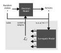

# Sealab SRF Electron Gun Optimization using Deep Learning
<a href="https://pytorch.org/get-started/locally/"></a>

A deep-learning based optimization of the SRF Electron Gun at Sealab, Helmholtz-Zentrum Berlin.

## Graphical Abstract


## Quick Start

```py
import torch
from optimizers import load_model_critic_net
from model import RandomIterableDataset

repetitions = 10
device=torch.device('cuda') if torch.cuda.is_available() else torch.device('cpu')

# Load Decision Model and loss surrogate model
model, critic_net = load_model_critic_net(device)

# Dataset of random states
ds = RandomIterableDataset(repetitions, 8, 10000000, device)

for state in ds:
    state = state.unsqueeze(0)
    # Evaluate Decision Model
    with torch.no_grad():
        action = model(state)
    # Calculate loss using surrogate model
    loss = critic_net.denormalize_reward(critic_net(action, state)).squeeze()
    
    print(f"State:  {state.squeeze().tolist()}")
    print(f"Action: {action.squeeze().tolist()}")
    print(f"Loss:   [l_1={loss[0]:.4f} mm, l_2={loss[1]:.4f} mm, l_3={loss[2]:.4f} mm]")
```

## Citation

If you find this useful in your research, please consider citing:

[Optimizing a superconducting radio-frequency gun using deep reinforcement learning.](https://journals.aps.org/prab/abstract/10.1103/PhysRevAccelBeams.25.104604)

    @article{PhysRevAccelBeams.25.104604,
      title = {Optimizing a superconducting radio-frequency gun using deep reinforcement learning},
      author = {Meier, David and Ramirez, Luis Vera and V\"olker, Jens and Viefhaus, Jens and Sick, Bernhard and Hartmann, Gregor},
      journal = {Phys. Rev. Accel. Beams},
      volume = {25},
      issue = {10},
      pages = {104604},
      numpages = {10},
      year = {2022},
      month = {10},
      publisher = {American Physical Society},
      doi = {10.1103/PhysRevAccelBeams.25.104604},
    }

